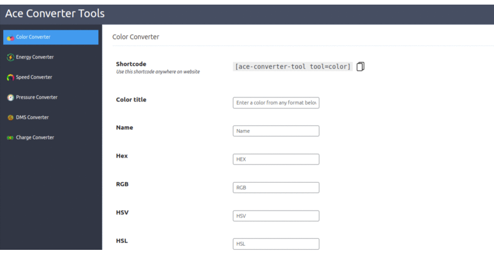
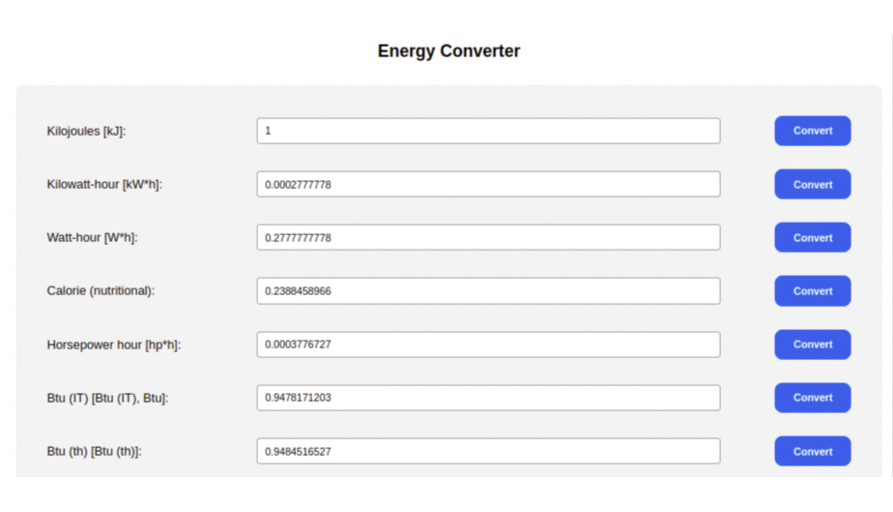

## Ace Converter Tools
Your all-in-one solution for seamless unit conversions and color transformations! This versatile plugin effortlessly converts energy across various units, from joules to kilojoules and watts, accommodating your diverse needs. Transform colors with precision, displaying shades in RGB, HEX, and HSV codes.

Switch effortlessly between speed units, including foot per second to meters per second, kilometers per hour, and more. Navigate pressure conversions with ease, from Pascals to Kilopascals. The plugin simplifies geographic coordinates with its Decimal Degrees to DMS converter. Charge conversion is a breeze, from Megacoulombs to Coulombs. Customize your experience with shortcodes for color, speed, pressure, DMS, and charge conversions. 

### ⚡️ FEATURES
> * Ace Converter Tools Plugin effortlessly handles energy unit conversions, including joules to kilojoules and watts.
> * Seamlessly transforms colors between RGB, HEX, and HSV codes for versatile color representation.
> * Conveniently converts speed units like centimeters per second to miles per second, kilometers per hour, kilometers per second and meters per second.
> * Navigates pressure units from Pascals to Kilopascals for precise pressure-related calculations.
> * Simplifies geographic coordinates with Decimal Degrees to DMS conversion for location data.
> * Effortlessly converts charge units, such as Megacoulombs to Coulombs, enhancing charge-related calculations.
> * Customize titles and hide specific energy units while using shortcodes for quick access to conversions.
> * Ensures a user-friendly interface for intuitive and efficient handling of complex unit and color transformations.
> * A versatile tool covering a wide range of units and formats, suitable for professionals in various fields.
> * Ace Converter Tools Plugin guarantees accuracy and efficiency in energy, color, speed, pressure, DMS, and charge conversions.

### Installation
1. Navigate to the **“Plugins”** menu in WordPress.
1. Search for the **“Ace Converter Tools”**.
1. Click the **“Install”** button.
1. Once installed, click the **“Activate”** button to activate the plugin.
1. After activation, you will find a menu named "Ace tools." Simply take any shortcode from that menu and place it in any page or post.

### Preview Backend

### Preview Frontend
